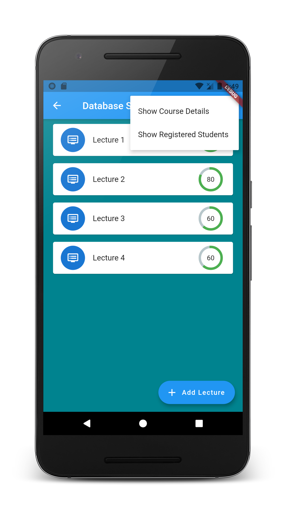

# Attendance Management App

A Flutter project for Students and Instructors to manage lecture attendance. Allows Instructor and Students to easily manage their attendance. 👨‍🏫 
## Objectives of App:
 * Make attendance taking process less time consuming and easier for Students and Instructors.
 * Allow Instructors to easily see at a glance the attendance of the class, and attendance of a specific student.
 * Make registering for a course easier for Student and Instructor. 
 * Instructor can easily view Students enrolled in course. 

## Learning Objectives

- [x] Learn how to use Firebase FireStore and Auth
- [x] Learn to better use provider for state management
- [x] Learn how to dynamically display data according to the logged-in user
- [x] Practice Flutter :laughing:

&nbsp;
## Future improvements

- [ ] Create a better UI with animations
- [ ] Google sign-in functionality
- [ ] Use Image Recognition to mark attendance of students

&nbsp;
## Screenshots
<table style="padding:5px">
    <th colspan = "3">Login and Register Screens</th>
    <tr>
        <td></td>
        <td></td>
        <td></td>
    </tr>
    <th colspan = "3">Instructor Screens</th>
    <tr>
        <td></td>
        <td></td>
        <td></td>
    </tr>
    <th colspan = "3">Student Screens</th>
    <tr>
        <td></td>
        <td></td>
        <td></td>
    </tr>
</table>

## Getting Started
### Prerequisites

Flutter and Android Studio should be installed and properly configured. 

To check proper installation:

```
cmd> flutter doctor -v
```

Create a firebase project with the package name `com.qasimsiddiqui.attendance_app`

Or if you want your own package name edit the file `android/app/build.gradle` and add your own package name to applicationId 
```
defaultConfig {
        // TODO: Specify your own unique Application ID (https://developer.android.com/studio/build/application-id.html).
        applicationId "com.qasimsiddiqui.attendance_app"

}
```

Add your `google-services.json` file to `android/app/`
### Run

To run the project, simply run `pub get` and run project on any emulator using `flutter run`.

&nbsp;
## Built with ❤ using [Flutter](http://www.flutter.dev) 

## Authors
* **M. Qasim Siddiqui** - [qasimsiddiqui](https://github.com/qasimsiddiqui)
